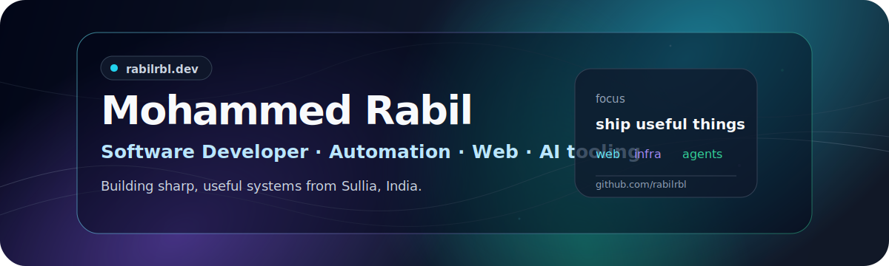

<p align="center">
  
</p>

<h1 align="center">Mohammed Rabil</h1>

<p align="center">
  Software Developer building useful web apps, automation, AI-assisted tooling, and self-hosted systems.
</p>

<p align="center">
  <a href="https://rabilrbl.github.io/">Portfolio</a>
  ·
  <a href="https://github.com/rabilrbl">GitHub</a>
  ·
  <a href="https://www.linkedin.com/in/rabilrbl/">LinkedIn</a>
  ·
  <a href="https://t.me/rabilrbl">Telegram</a>
</p>

<p align="center">
  
  
  
</p>

---

## What I build

- Fast, clean web experiences with modern React tooling.
- Automation that removes repetitive work and keeps systems boring.
- AI-assisted developer workflows, agents, and practical integrations.
- Self-hosted infrastructure, home-lab services, and network tooling.

## Current signal

```txt
Ship useful things. Keep the stack simple. Make the interface feel sharp.
```

## Toolbox

<p>
  
  
  
  
  
  
  
  
  
  
  
</p>

## GitHub stats

<p align="center">
  
  
</p>

---

<p align="center">
  <i>Always building. Usually automating. Occasionally over-engineering, then deleting half of it.</i>
</p>
